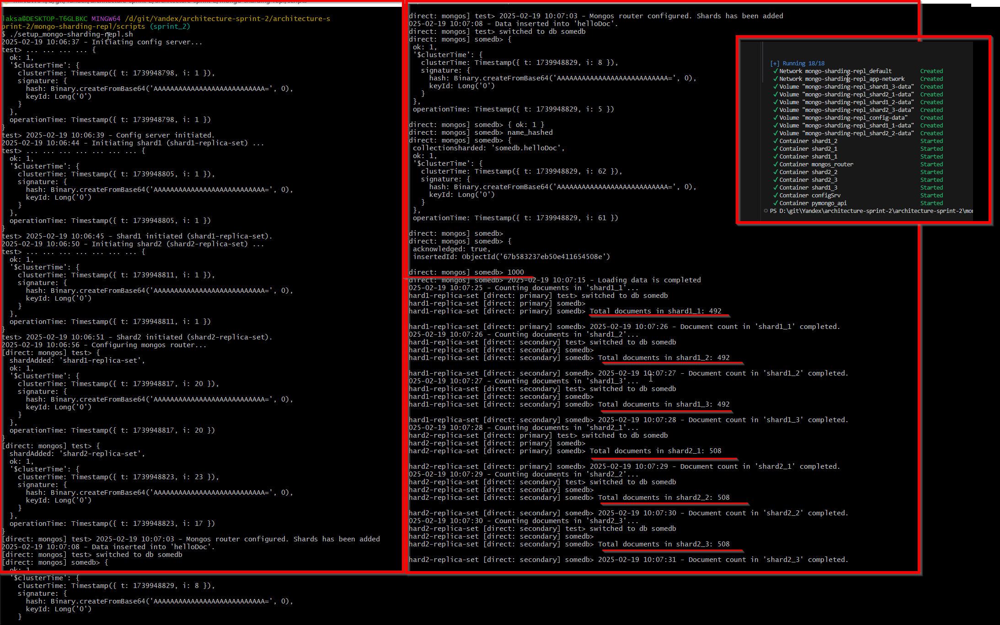

# Mongo-Sharding-Repl

## Описание

Этот проект автоматизирует настройку и запуск MongoDB с **_репликацией_** и шардингом с использованием Docker Compose.

## Шаги установки

Все шаги настройки описаны в скрипте:

```shell
./scripts/setup_mongo-sharding-repl.sh
```

## Запуск

### 1. Запускаем контейнеры Docker

```shell
docker compose up -d
```

### 2. Инициализация конфигурации и данных

```shell
./scripts/setup_mongo-sharding-repl.sh
```

В скрипте предусмотрены логи для отслеживания выполнения каждого шага.

## Дополнительная информация

Полностью очистить данные можно с помощью:

```shell
docker volume prune -a
```

## Отчет

### 1. Итоговый скриншот с количеством элементов в разных шардах


