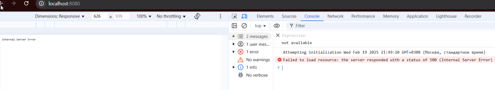

# Sharding-Repl-Cache

## Описание

Этот проект автоматизирует настройку и запуск MongoDB с репликацией, шардингом и **_кэшированием_** Redis с использованием Docker Compose.

## Шаги установки

Все шаги настройки описаны в скрипте:

```shell
./scripts/setup_mongo-sharding-repl-cache.sh
```

## Запуск

### 1. Запускаем контейнеры Docker

```shell
docker compose up -d
```

### 2. Инициализация конфигурации и данных

```shell
./scripts/setup_mongo-sharding-repl-cache.sh
```

В скрипте предусмотрены логи для отслеживания выполнения каждого шага.

## Дополнительная информация

Полностью очистить данные можно с помощью:

```shell
docker volume prune -a
```

Упрощенная команда для быстрого измерения времени запроса

```shell
curl -o /dev/null -s -w %{time_total} http://localhost:8080/helloDoc/users
```

## Отчет

Скришот ошибки на домашнем ПК


Я потратил сутки, чтобы понять почему по curl http://localhost:8080 приложение pymongo_api недоступно. Ошибка Internal Server Error.
Перепробвал различные варианты: network ( app-network:), зеркала, разные порты и тд. Долго думал, что контейнеры в разных под сетях.
Ссылка на дискуссию [https://app.pachca.com/chats/18410889?message=438279505] в чате.

Запускал на виртуальной машине Ubuntu. Это ввело меня в заблуждение, что на двух разных ПК одинаковая ошибка.


На домашнем ПК, примерно раз 40 перезапускал контейнеры на Windows. Решил запустить на рабочем ПК и все **_АНАЛОГИЧНОЕ (тот же код)_**
запустилось с первого раза. 

### 1. Итоговый скриншот с улучшенным временем после кэширования запроса GET **_/helloDoc/users_**


