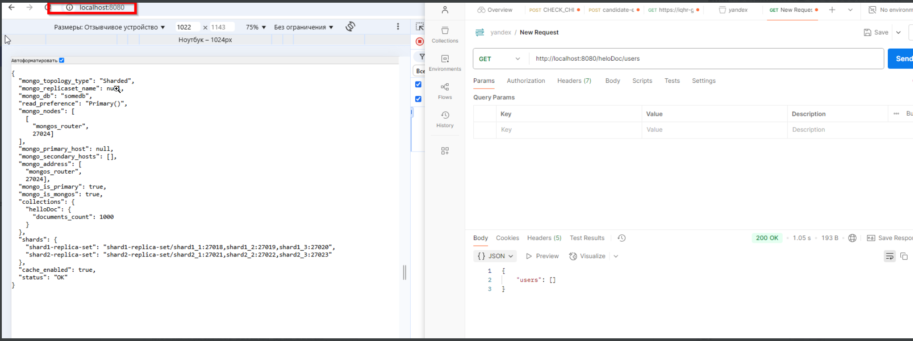

# Sharding-Repl-Cache

## Шаги

- Я потратил сутки, чтобы понять почему по curl http://localhost:8080 приложение pymongo_api недоступно. Ошибка Internal Server Error.
  Ссылка на дискуссию [https://app.pachca.com/chats/18410889?message=438279505] в чате.
- Запускал на виртуальной машине Ubuntu 
  На домашнем ПК, примерно раз 40 перезапускал контейнеры на Windows. Решил запустить на рабочем ПК и все аналогичное запустилось с первого раза. 

  Результат: на скриншоте видно, что первый запрос имеет наибольшое время выполнения, когда последующие получают данные из кэша
  

Осталось загадкой, почему на домашнем пк запуск контейнера по 8080 порту не работал, при этом http://localhost:8080/docs запускался

### Запуск

1. Запускаем docker compose с контейнерами

```shell
docker compose up -d
```

2. Запускаем скрипт для инициализации конфига и данных

```shell
setup_mongo-sharding-repl-cache.sh
```

Проверяем время запроса с кэшом

```shell
curl -o /dev/null -s -w %{time_total} http://localhost:8080/helloDoc/users
```
